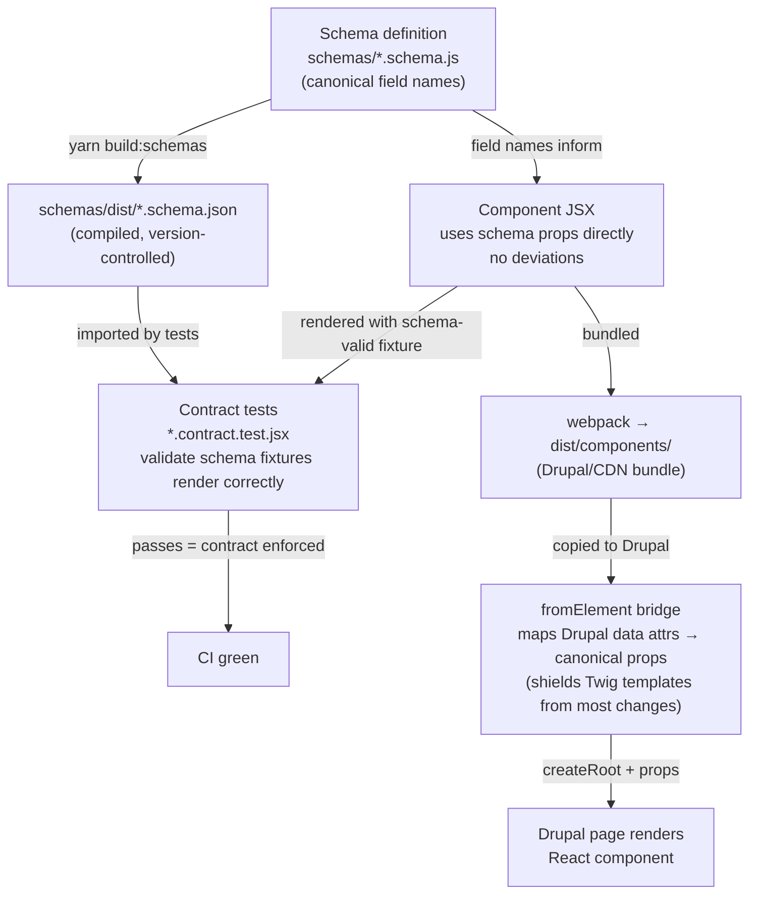

# Mangrove 2.0 release notes

> Edits to this file show up on both [GitHub](https://github.com/unisdr/undrr-mangrove/blob/main/docs/RELEASE-2.0.md) and in [Storybook](https://unisdr.github.io/undrr-mangrove/?path=/docs/getting-started-release-notes-v2-0--docs).

Mangrove 2.0 is the schema-alignment release. The main change: nine components have breaking prop renames to use canonical field names derived from the [content architecture schemas](https://unisdr.github.io/undrr-mangrove/?path=/docs/design-decisions-content-architecture--docs), replacing ad-hoc prop names that had accumulated over multiple releases. MegaMenu receives a new optional `ariaLabel` prop (non-breaking).

> **If you maintain a Drupal site or consume Mangrove via npm:** this release contains breaking prop changes. Read the [migration guide](#migration) carefully. Most Drupal data attribute configurations are unaffected — the `fromElement` bridge absorbs the changes transparently. Component-by-component prop rename tables and before/after code examples are in [docs/MIGRATION-SCHEMA-V2.md](https://github.com/unisdr/undrr-mangrove/blob/main/docs/MIGRATION-SCHEMA-V2.md).

## Authoring flow (new)

Schema-first development is now the standard workflow for Mangrove components. When a component maps to an existing content archetype, its prop names are determined by the schema — not by the first name that came to mind when the component was written.



The five-step workflow:

1. **Author or update the schema** in `schemas/` using canonical field names
2. **Implement the component** using those field names directly as props — no translation layer
3. **Write the Storybook story** using a schema-valid fixture
4. **Write a contract test** that validates the fixture against the schema and renders the component
5. **Run `yarn build:schemas && yarn test`** — if both pass, the schema and component agree

See the [component guide](https://unisdr.github.io/undrr-mangrove/?path=/docs/contributing-build-a-component-step-by-step--docs) for the full workflow.

## Find your path

| Your situation | What to do | Section |
|---|---|---|
| Drupal site, component rendered via `fromElement` (QuoteHighlight, ShareButtons, TextCta, MegaMenu) | No Twig changes needed — `fromElement` handles the mapping | [Shielded consumers](#shielded-consumers) |
| Drupal site, component rendered via JSON blob (IconCard, StatsCard) | Update the JSON output from Gutenberg/Twig | [Consumers requiring updates](#consumers-requiring-updates) |
| npm consumer or direct React import (all components) | Update prop names at call sites | [Migration](#migration) |
| Mangrove contributor | Follow the schema-first workflow | [Authoring flow](#authoring-flow-new) |

## What's in 2.0

### Breaking prop renames

Nine components have breaking prop renames to align with canonical schema field names. The full rename table is in the [migration guide](https://github.com/unisdr/undrr-mangrove/blob/main/docs/MIGRATION-SCHEMA-V2.md).

| Component | Schema | Breaking change |
|---|---|---|
| VerticalCard | card | `data`→`items`, `imgback`/`imgalt`→`image.{src,alt}`, `label1`/`label2`→`labels[]`, `summaryText`→`summary` |
| HorizontalCard | card | Same as VerticalCard |
| BookCard | card | `data`→`items`, `imgback`/`imgalt`→`image.{src,alt}` |
| HorizontalBookCard | card | Same as VerticalCard |
| IconCard | card | `data`→`items`, `imgback`/`imgalt`→`image.{src,alt}`, `label`→`labels[0]`, `summaryText`→`summary` |
| StatsCard | statistic | `stats[].summaryText`→`stats[].summary` |
| QuoteHighlight | quote | `imageSrc`/`imageAlt`→`image.{src,alt}` |
| ShareButtons | share-action | `SharingSubject`→`sharingSubject`, `SharingTextBody`→`sharingBody` |
| TextCta | text-cta | `image` (URL string) + `imageAlt`→`image.{src,alt}` |

### Non-breaking additions

| Component | Schema | Change |
|---|---|---|
| MegaMenu | navigation | Added optional `ariaLabel` prop (default: `'Main Navigation'`) — allows customizing the nav landmark's accessible name per page context |

### Contract tests

Each schema-covered component now has a `*.contract.test.jsx` file that:
- Compiles the relevant JSON Schema
- Validates schema fixtures against it (AJV 2020-12)
- Renders schema-valid fixtures through the component
- Runs an axe accessibility check on the rendered output

These tests form the enforcement layer: if a future change introduces a prop name mismatch or breaks rendering of a schema-valid fixture, the test suite fails before anything ships.

### Security: DOMPurify on QuoteHighlight HTML fields

`QuoteHighlight` accepts `quote`, `attribution`, and `attributionTitle` as HTML strings (for inline links and emphasis). These were previously passed directly to `dangerouslySetInnerHTML` without sanitization. All three fields are now wrapped in `DOMPurify.sanitize()`, consistent with the pattern used by TextCta, StatsCardItem, and HorizontalCard.

### Schema metadata updates

All seven content architecture schemas (`card`, `statistic`, `quote`, `share-action`, `text-cta`, `navigation`, `gallery`) are updated to `version: "2.0.0"`, `phase: 2`, and empty `deviations` maps — reflecting that the canonical field names are now implemented everywhere.

## Migration

Full per-component rename tables, before/after code examples, and Drupal data attribute notes are in [docs/MIGRATION-SCHEMA-V2.md](https://github.com/unisdr/undrr-mangrove/blob/main/docs/MIGRATION-SCHEMA-V2.md).

### Shielded consumers

These components have a `fromElement` bridge that constructs the new prop shape from the same Drupal data attributes as before. **No Twig template changes are needed.**

| Component | Old data attributes (unchanged) | New prop shape constructed by fromElement |
|---|---|---|
| QuoteHighlight | `data-image-src`, `data-image-alt` | `image: { src, alt }` |
| ShareButtons | `data-sharing-subject`, `data-sharing-body` | `sharingSubject`, `sharingBody` |
| TextCta | `data-image`, `data-image-alt` | `image: { src, alt }` |

### Consumers requiring updates

These components pass item data as a JSON blob in a single data attribute. The JSON object shape changes:

**IconCard** — `data-items` JSON:

```json
// Before
[{ "title": "...", "summaryText": "...", "label": "Category", "imgback": "/img.jpg", "imgalt": "Description" }]

// After
[{ "title": "...", "summary": "...", "labels": ["Category"], "image": { "src": "/img.jpg", "alt": "Description" } }]
```

**StatsCard** — `data-stats` JSON:

```json
// Before
[{ "value": "72%", "summaryText": "of countries have DRR strategies" }]

// After
[{ "value": "72%", "summary": "of countries have DRR strategies" }]
```

### React / npm consumers

Update prop names at each call site. Example for a card component:

```jsx
// Before
<VerticalCard data={[{
  title: 'Risk assessment guide',
  imgback: '/img/guide.jpg',
  imgalt: 'Cover image',
  label1: 'Report',
  label2: '2024',
  summaryText: 'A guide to national risk assessment.',
  link: '/publications/guide',
}]} />

// After
<VerticalCard items={[{
  title: 'Risk assessment guide',
  image: { src: '/img/guide.jpg', alt: 'Cover image' },
  labels: ['Report', '2024'],
  summary: 'A guide to national risk assessment.',
  link: '/publications/guide',
}]} />
```

### Verifying the upgrade

Run the contract tests to confirm your data shapes are valid. Schemas must be built first (the `schemas/dist/` output is gitignored):

```bash
yarn build:schemas && yarn test --testPathPattern="contract"
```

All 10 contract test files validate schema-valid fixtures against the component. If your data passes schema validation, the component will render it.

## Upgrading from 1.x

1. Update your dependency: `yarn add @undrr/undrr-mangrove@^2.0.0` (or update `package.json` and `yarn install`)
2. If you load Mangrove CSS from the CDN, update the version number in your `<link>` tags. No CSS changes in this release — your child theme CSS files from 1.4 are still current.
3. Copy the updated compiled JS to your Drupal `mangrove-components/` directory
4. Check the [find your path](#find-your-path) table — most Drupal consumers need no Twig changes
5. For IconCard and StatsCard: update the JSON blob output from Gutenberg/Twig

React component APIs are otherwise unchanged — same export names, same CSS class names, same `data-mg-*` attribute selectors. Only the props listed in the rename table above have changed.

---

## For Mangrove contributors

### Schema-first development rules

1. **New components that match an existing archetype** (card, statistic, quote, navigation, share-action, gallery, text-cta) must use the canonical field names from `schemas/`.
2. **If no schema exists** for your archetype, author one first, then implement the component.
3. **Never introduce a prop name that differs from the schema** without documenting it in `x-mangrove.deviations` and opening a Phase 3 issue.
4. **Contract tests are required** for all schema-covered components. See `stories/Components/Cards/Card/__tests__/VerticalCard.contract.test.jsx` for the reference pattern.

### AJV setup

Always use `createAjv()` from `schemas/ajv-setup.js` — never instantiate AJV directly:

```js
import { createAjv } from '../../../../schemas/ajv-setup.js';
import schema from '../../../../schemas/dist/my-content.schema.json';

const validate = createAjv().compile(schema);
```

## Related documentation

- [Content architecture](https://unisdr.github.io/undrr-mangrove/?path=/docs/design-decisions-content-architecture--docs) — schema inventory and field-name contracts
- [Migration guide](https://github.com/unisdr/undrr-mangrove/blob/main/docs/MIGRATION-SCHEMA-V2.md) — full rename tables and before/after code examples
- [Component guide](https://unisdr.github.io/undrr-mangrove/?path=/docs/contributing-build-a-component-step-by-step--docs) — schema-first development workflow
- [Release process](https://unisdr.github.io/undrr-mangrove/?path=/docs/contributing-release-process--docs) — how Mangrove versions are published
