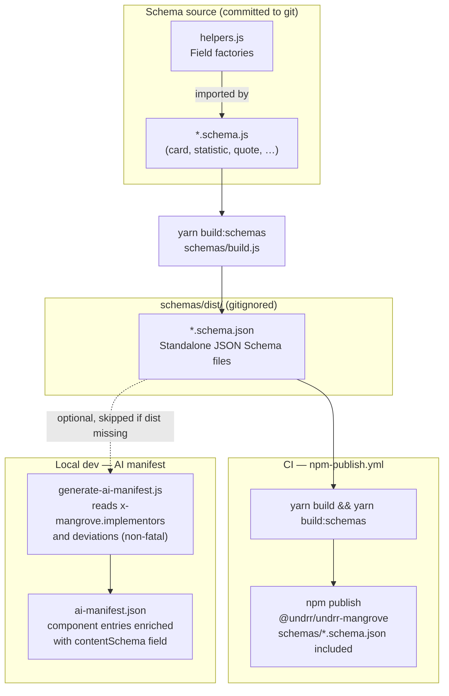

# Mangrove content architecture: schemas

Mangrove's **content architecture** defines the structural contracts between data
and components — what each component *carries*, independent of how it looks.
JSON Schema is the mechanism for formalizing and locking those contracts in.

These schema files are Phase 1: a canonical reference spec for each component
archetype. No existing component props are changed here. Deviations between
the canonical field names and current prop names are recorded explicitly;
resolving them is Phase 2.

## Documentation

The full rationale and schema inventory are documented in Storybook:
**[Design decisions / Content architecture](https://unisdr.github.io/undrr-mangrove/?path=/docs/design-decisions-content-architecture--docs)**

## Status

**Phase 1: first step toward a formal content architecture.** Schemas document
the target data contract. They do not yet drive validation, code generation, or
contract tests. Existing components may use different field names — deviations are
documented in each schema's `x-mangrove.deviations` metadata.

See [issue #881](https://github.com/unisdr/undrr-mangrove/issues/881) for the
full vision and [issue #883](https://github.com/unisdr/undrr-mangrove/issues/883)
for Phase 1 scope.

## Quick start

Built JSON files are generated into `schemas/dist/` (gitignored) and published
to npm under `schemas/`. Install from npm or build locally:

```bash
# From npm
npm install @undrr/undrr-mangrove
# schemas available at: node_modules/@undrr/undrr-mangrove/schemas/*.schema.json
```

To build locally after editing schema sources:

```bash
yarn build:schemas
```

To rebuild with validation:

```bash
yarn build:schemas --validate
```

## Schema inventory

| Schema | Description | Implementing components |
|--------|-------------|------------------------|
| card | Content card with image, labels, title, summary, CTA | VerticalCard, HorizontalCard, BookCard, HorizontalBookCard, IconCard |
| statistic | Key metrics display with icon, value, labels | StatsCard, StatsCardItem |
| quote | Highlighted quote with attribution and image | QuoteHighlight |
| navigation | Multi-level navigation with section banners | MegaMenu |
| share-action | Social sharing buttons with localized labels | ShareButtons |
| gallery | Media gallery (images, videos, embeds) | Gallery |
| text-cta | Call-to-action banner with heading, text, buttons | TextCta |

## Schema format

Each schema is a [JSON Schema 2020-12](https://json-schema.org/draft/2020-12/schema)
document with these conventions:

- **`$id`**: Stable identifier in the form
  `https://github.com/unisdr/undrr-mangrove/schemas/{name}`
- **`x-mangrove`**: Extension namespace containing:
  - `version` — Schema version
  - `phase` — Implementation phase (currently 1)
  - `implementors` — Mangrove component names that implement this schema
  - `deviations` — Map of canonical field paths to notes about how current
    component implementations differ
  - `notes` — Additional context about the schema

### Custom format annotations

- **`"format": "html"`** — The string field accepts sanitized HTML. Consumers
  must sanitize before rendering (Mangrove uses DOMPurify).
- **`"format": "uri"`** — Standard URI format.

### Content and presentation fields

Schemas include both content fields (title, summary, image) and presentation
attributes (variant, iconColor, backgroundColor). If a consumer needs to
provide the value to use the component correctly, it is part of the schema.

## Deviation notes

Schemas define **canonical** field names — the target contract. Current
component props may differ. These deviations are recorded in each schema's
`x-mangrove.deviations` object and summarized here:

| Canonical (schema) | Current (component) | Affected components |
|---|---|---|
| `items` | `data` | All cards |
| `items[].image.src` | `imgback` | All cards |
| `items[].image.alt` | `imgalt` | All cards |
| `items[].labels[]` | `label1`, `label2` | VerticalCard, HorizontalCard, HorizontalBookCard |
| `items[].summary` | `summaryText` | All cards |
| `stats[].summary` | `summaryText` | StatsCard |
| `image.src` / `image.alt` | `imageSrc` / `imageAlt` | QuoteHighlight |
| `image.src` / `image.alt` | `image` / `imageAlt` | TextCta |
| `sharingSubject` | `SharingSubject` | ShareButtons |
| `sharingBody` | `SharingTextBody` | ShareButtons |

These deviations will be resolved in Phase 2 when components are updated to
use canonical field names.

## Adding a new schema

1. Create `schemas/{name}.schema.js` exporting a default JSON Schema document
2. Use helpers from `schemas/helpers.js` for DRY field definitions
3. Wrap with `schemaDocument()` to get the standard envelope
4. Document `implementors` and any `deviations` in the `meta` object
5. Run `yarn build:schemas --validate` to generate and validate
6. Update this README's schema inventory table

## Architecture

```
schemas/
  helpers.js              Field definition factory functions
  *.schema.js             Schema source files (JS modules)
  build.js                Build script (JS -> JSON)
  dist/                   Built JSON files (gitignored, generated by build)
    *.schema.json
  __tests__/
    schemas.test.js       Validation tests
```

Source schemas are JS modules (not raw JSON) so they can use helpers, imports,
variables, and comments. The build script imports each and serializes to JSON.

### Integration diagram


